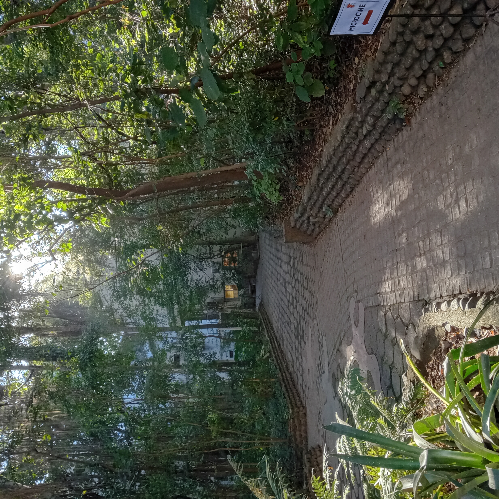

    

        <dt>
            <cite>Tenemos una abogada en la familia</cite>
            – 27/07/2026
        </dt>
        <dd>
            
La pachi se recibió finalmente. La verdad que tantos años de estudio deben dejarte agotado. Supongo que ella no se olvidará del 27/07/2026 nunca, yo no me olvidaría.

            

                
            

        </dd>
    

    

        <dt>
            <cite>Resumen de Junio en casi la mitad de Julio</cite>
            – 16/07/2026
        </dt>
        <dd>
            
Me acordé de muchas fotos de momentos lindos de Junio. Quiero subirlos para acordarme que no fue todo solamente estudiar y sufrir y quejarse.

            

                
                
                
            

        </dd>
    

    

        <dt>
            <cite>Fuimos a tafí y a la final también.</cite>
            – 15/07/2026
        </dt>
        <dd>
            
Este es de los primeros mundiales que veo activamente porque no soy muy futbolero pero me estoy re divirtiendo. Nos tomamos una semanita en tafí y los invité a los chicos y se sintió como un mes entero de descanso que hermoso.

            

                
                
                
            

        </dd>
    

    

        <dt>
            <cite>Recordando tiempos oscuros</cite>
            – ¿?/¿?/2026
        </dt>
        <dd>
            
Me encantan estas cuatro fotos adjuntas porque demuestran muy bien como me esforcé en ser una persona humana sensible y cansable este cuatrimestre espantoso. Para que yo no me diga a mi mismo después que no hago nada más que estudiar sin razón. Estudié y lo hice con mucho empeño, buena onda y muy buena compañía a pesar de todo.

            

                
                
                
                
            

        </dd>
    

    

        <dt>
            <cite>Por fin un breve descanso.</cite>
            – 11/07/2026
        </dt>
        <dd>
            
Me colgué un poco de subir cosas al blog, pero estuve reflexionando mucho y la nube en la que venía viviendo está de a poquito disipándose. Estoy contento porque el Señor me regaló un respiro. Fue el día de la Patria y lo disfruté mucho. Pasaron varias cosas en esta primer semana de vacaciones, tanto que se siente como si hubiese pasado más tiempo. Empecé folklore. Estoy muy contento porque el invierno/otoño está durando mucho y yo estoy pudiendo disfrutarlo bastante.

            

                
                
                
                
                
                
                
                
            

        </dd>
    

    

        <dt>
            <cite>Este mes fue infinito. Todos estos meses fueron infinitos. Pero hoy es el día del padre.</cite>
            – 21/06/2026
        </dt>
        <dd>
            
Además de rendir, cursar, rendir, estudiar y rendir, tuve un poco de vida. Aquí están las pruebas. Feliz día pa! Te mereces un descanso.

            

                
                
                
                
                
                
                
            

        </dd>
    

    

        <dt>
            <cite>Una foto de Paraguay 🇵🇾</cite>
            – 0?/0?/2026
        </dt>
        <dd>
            
Me da curiosidad este país.

            

                
            

        </dd>
    

    

        <dt>
            <cite>El segundo cafesito de la semana</cite>
            – 05/06/2026
        </dt>
        <dd>
            
La Emi me volvió adicto a los cafeistos y Fran me hizo ejercer la adicción. Hablamos de cosas tremendas, como la digitalización de la vida y lo raro que se siente. También de como Google eventualmente iba a conquistar el planeta.

            

                
            

        </dd>
    

    

        <dt>
            <cite>Viajé a Tafí con la gente de Petrología</cite>
            – 03/06/2026
        </dt>
        <dd>
            
Fue linda la campaña pero me dejó muerto. Lo peor de ir de caminata no es que caminemos mucho, es que paramos cada dos minutos por media hora y eso te cansa mucho. Aparte no habia llegado a afeitarme.

            

                
            

        </dd>
    

    

        <dt>
            <cite>Recibiendo junio con un cafesito</cite>
            – 01/06/2026
        </dt>
        <dd>
            
Acaba de empezar la semana y estabamos todos cansados. Fran nos invitó a tomar un café a la Shell. Es muy gracioso como es un evento masculino tomar un café en una estación de servicio. Hablamos de varias cosas como la frustración, las novias, el paso del tiempo, el futuro, el trabajo, el estudio y nuestros miedos. Estabamos todos un poquito bajoneados, quizás es la famosa crisis de los 20.

            

                
            

        </dd>
    

    

        <dt>
            <cite>Planté una suculenta</cite>
            – 30/05/2026
        </dt>
        <dd>
            
En mi casa, mi mamá nos quiere a los varones como los cuidadores oficiales del jardín. Todos lo intentamos y tratamos de perseverar lo más que se puede. En el verano más que nada hacemos algo. Yo tengo la condición de tocar-matar en la jardinería. Así que estoy entrenando, esta va a ser mi primer plantita oficialmente mía y voy a encargarme de no muera. Voy a estar contandoles como viene la mano.

            

                
            

        </dd>
    

    

        <dt>
            <cite>Feliz día de la Patria</cite>
            – 25/05/2026
        </dt>
        <dd>
            
Hoy deberíamos todos tener una escarapela.

            

                
            

        </dd>
    

    

        <dt>
            <cite>Caos</cite>
            – 24/05/2026
        </dt>
        <dd>
            
la idea era hacer un antes y un después pero hice solo un antes.

            

                
                
            

        </dd>
    

    

        <dt>
            <cite>Estoy viviendo el otoño</cite>
            – 20/05/2026
        </dt>
        <dd>
            
Me encanta cómo se ve el otoño. Acá es como que el sol es muy brillante y todo se ve en reposo. Es muy descansador.

            

                
                
                
                
            

        </dd>
    

    

        <dt>
            <cite>Conociendo un barsito nuevo</cite>
            – 16/05/2026
        </dt>
        <dd>
            
Quedaba un poco más lejos. Hablamos de lo frustrado que me sentí por la facultad.

            

                
            

        </dd>
    

    

        <dt>
            <cite>Cumple Draculín 20 años. 🎉</cite>
            – 17/04/2026
        </dt>
        <dd>
            
Drac festejó su cumple en su casa, Germán cocinó las hamburguesas a la parrilla. Fran y yo llegamos cuando todo ya estaba hecho y las novias estaban invitadas. Nos sacamos un par de fotos. Tocamos la "Chacarera Del Desautado".

            

                
                
            

        </dd>
    

    

        <dt>
            <cite>Salida con la Emi después de Pascua</cite>
            – 10/04/2026
        </dt>
        <dd>
            
Salimos con la Emi a comer hamburguesas para conversar y ponernos al día por un rato. Venimos teniendo semanas muy largas y frías.

            

                
            

        </dd>
    

    

        <dt>
            <cite>Cierre Pascua Joven</cite>
            – 05/04/2026
        </dt>
        <dd>
            
Al final salió todo bien. Estuve sin celular por esos días y me sirvió mucho para entregarme a los otros.

            

                
            

        </dd>
    

    

        <dt>
            <cite>El árbol del siambon</cite>
            – 23/03/2026
        </dt>
        <dd>
            
Fuimos con los chicos a buscar madera para que lolo pueda tallar. Terminamos talando un árbol.

            

                
                
            

        </dd>
    

    

        <dt>
            <cite>Comiendo Papas</cite>
            – 22/03/2026
        </dt>
        <dd>
            
Hoy la Emi de la nada me llamó para preguntarme si quería salir a comer papas. Le dije que si.

            

                
                
            

        </dd>
    

    

        <dt>
            <cite>Convivencia pre-Pascua Joven</cite>
            – 21/03/2026
        </dt>
        <dd>
            
Fue medio agotador, pero estuvo genial, los chicos le pusieron un montón de esfuerzo, recen por nosotros, para que salga todo bien.

            

                
            

        </dd>
    

