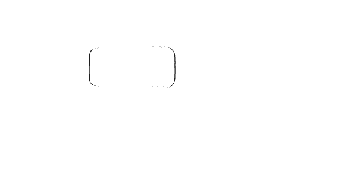

  
  <map name="image-map">
    <area target="" alt="Galería" title="Galería" href="https://salvamir.github.io/galería" coords="176,218,17,167" shape="rect">
    <area target="" alt="Visitas" title="Visitas" href="https://salvamir.github.io/libro-de-visitas" coords="124,205,259,312" shape="rect">
    <area target="" alt="Música" title="Música" href="https://salvamir.github.io/Música/" coords="156,85,289,141" shape="rect">
    <area target="" alt="Inicio" title="Inicio" href="https://salvamir.github.io" coords="229,140,362,218" shape="rect">
    <area target="" alt="Links" title="Links" href="https://salvamir.github.io/links" coords="405,281,237,246" shape="rect">
    <area target="" alt="Libros" title="Libros" href="https://salvamir.github.io/librería" coords="449,154,585,207" shape="rect">
    <area target="" alt="Ahora" title="Ahora" href="https://salvamir.github.io/ahora" coords="316,13,412,112" shape="rect">
    <area target="" alt="Notas" title="Notas" href="https://salvamir.github.io/Notas" coords="347,94,485,180" shape="rect">
    <area target="" alt="Jardin Digital" title="Jardin Digital" href="https://salvamir.github.io/El-Jardín" coords="394,49,578,116" shape="rect">
    <area target="" alt="Algo Más" title="Algo Más" href="https://salvamir.github.io/algo-mas" coords="513,308,373,267" shape="rect">
    <area target="" alt="Cuentos" title="Cuentos" href="https://salvamir.github.io/Cuentos/" coords="542,261,424,187" shape="rect">
  </map>

  <a href="https://salvamir.github.io" class="boton-pildora">Inicio</a>
  <a href="https://salvamir.github.io/Música/" class="boton-pildora">Música</a>
  <a href="https://salvamir.github.io/galería" class="boton-pildora">Galería</a>
  <a href="https://salvamir.github.io/El-Jardín" class="boton-pildora">Jardín Digital</a>
  <a href="https://salvamir.github.io/Notas" class="boton-pildora">Notas</a>
  <a href="https://salvamir.github.io/librería" class="boton-pildora">Libros</a>
  <a href="https://salvamir.github.io/Cuentos/" class="boton-pildora">Cuentos</a>
  <a href="https://salvamir.github.io/ahora" class="boton-pildora">Ahora</a>
  <a href="https://salvamir.github.io/links" class="boton-pildora">Links</a>
  <a href="https://salvamir.github.io/libro-de-visitas" class="boton-pildora">Visitas</a>
  <a href="https://salvamir.github.io/algo-mas" class="boton-pildora">Algo Más</a>

Soy Salvador, vivo en Argentina, hago música cuando puedo, estudio Geología y tengo 5 hermanos. Creo en Dios y persevero en algunos grupos de la Iglesia.  En esta página tengo archivados momentos, ideas, pensamientos, fotos, cuentos, etc. Es como una caja de recuerdos enorme. Por eso es medio un lío desplazarse por este espacio, pero intenté hacerlo intuitivo. [[Lluvia De Ideas/index|index]]
## Para Curiosear:
Acá te dejo una lista de ensayos/artículos que anduve leyendo por internet. 
- ["Living With The Seasons", de Daniel ](https://danielslife.blog/posts/living-with-the-seasons)
- ["Biking Is Fun", de Nolan.](https://nolancaudill.com/2026/03/16/biking-is-fun/)
- ["Simplicity and Less", de Rafael.](https://rafaelkuebler.github.io/posts/20251207-simplicity-and-less/) 
- ["Secret Garden", de Tanner.](https://t0.vc/secret-garden)

![[quelindodía.png]]